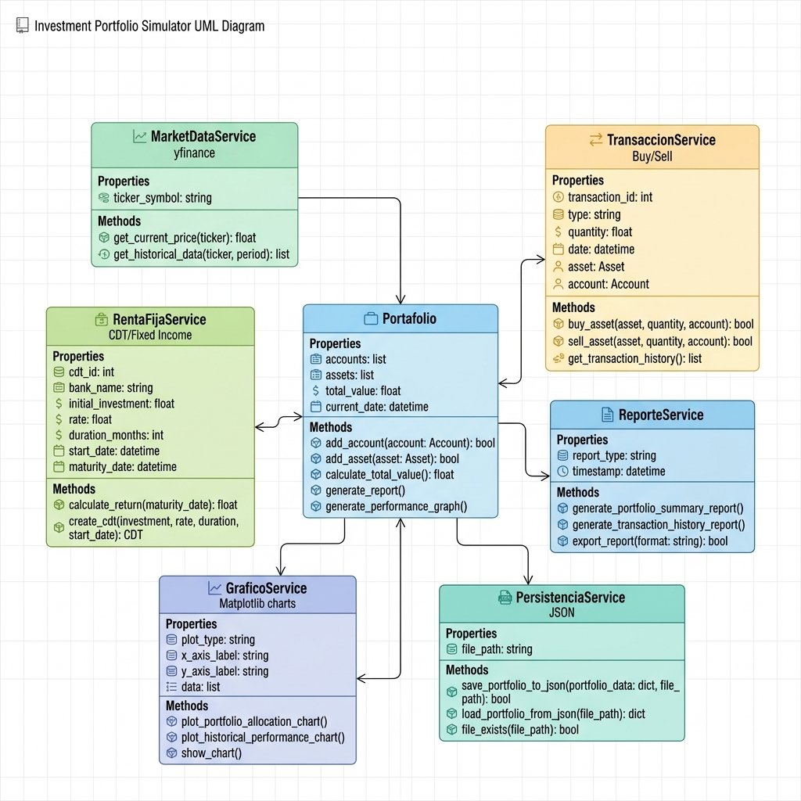

# Simulador de Portafolio de Inversión v2.0



### **Universidad — Materia: Estructura de Datos / Finanzas Computacionales**

Este es un simulador avanzado de gestión de portafolios de inversión desarrollado en Python. Permite a los usuarios gestionar activos de renta variable (Acciones) y renta fija (CDTs), utilizando datos reales del mercado financiero a través de la API de Yahoo Finance.

---

## Cumplimiento de la Rúbrica

Este proyecto ha sido diseñado para cumplir con todos los requisitos técnicos solicitados:
1.  **Universo de Activos:** Implementación de 10 acciones líderes del mercado.
2.  **Renta Variable y Fija:** Gestión de acciones y CDTs con tasas anuales configurables.
3.  **Liquidación Diaria:** Simulación de intereses de renta fija calculados día a día.
4.  **Datos Reales:** Uso de `yfinance` para precios de cierre, mínimos y máximos.
5.  **Rentabilidad Neta:** Cálculo dinámico considerando comisiones y dividendos.
6.  **Costos de Comisión:** Aplicación automática del 0.1% en cada transacción.
7.  **Validación de Capital:** Control estricto de fondos antes de ejecutar órdenes.
8.  **Representación Gráfica:** 4 visualizaciones completas del rendimiento y composición.
9.  **Coherencia de Precios:** Validación de precios de ejecución dentro del rango diario (Min/Max).

---

## Características Principales

*   **Datos Reales:** Integración con `yfinance` para obtener precios de cierre, mínimos y máximos en tiempo real.
*   **Gestión de Acciones:** Compra y venta de activos con cálculo automático de comisiones de broker y precio promedio ponderado.
*   **Renta Fija (CDTs):** Simulación de certificados de depósito que generan intereses diarios y se liquidan al vencimiento.
*   **Dividendos:** Consulta y cobro automático de dividendos con aplicación de retenciones de ley.
*   **Gráficos Avanzados:** Generación de visualizaciones con `matplotlib`:
    *   Evolución histórica del valor total.
    *   Composición del portafolio (Efectivo vs Acciones vs CDTs).
    *   Historial de precios por activo.
    *   Rentabilidad neta por acción.
*   **Persistencia:** Guardado y carga automática del estado del portafolio en formato JSON.

---

## Tecnologías Utilizadas

*   **Python 3.x**
*   **Librerías:**
    *   `yfinance`: Datos del mercado financiero.
    *   `pandas`: Manejo de series de tiempo y estructuras de datos.
    *   `matplotlib`: Generación de reportes visuales.
    *   `json`: Almacenamiento de datos.

---

## Estructura de Datos

El núcleo del programa utiliza una organización orientada a objetos para gestionar la complejidad del mercado financiero:
*   **Clase Portafolio:** Centraliza el capital, el diccionario de posiciones (Hash Maps para búsqueda rápida O(1)) y listas de transacciones (O(1) para inserción).
*   **Gestión de Historial:** Implementa un registro cronológico de operaciones para el análisis de rendimiento temporal.

---

## Instalación y Uso

1. **Clonar el repositorio:**
   ```bash
   git clone https://github.com/yechavarria17-commits/Inversionistas-so-adores.git
   ```

2. **Instalar dependencias:**
   ```bash
   pip install yfinance pandas matplotlib
   ```

3. **Ejecutar el simulador:**
   ```bash
   python simulador.py
   ```

---

# Instrucciones de Operación

1. Al iniciar por primera vez, ingresa tu **capital inicial** en USD.
2. Utiliza el **Menú Principal** para navegar entre las opciones (compra, resumen, gráficas, etc.).
3. El sistema guarda automáticamente tus cambios al salir (**Opción 0**).

---

# Autores
Desarrollado para la facultad de ingeniería/Estructura de datos
**Usuario:** yechavarria17
yeison alexander lopez

---
*Este proyecto tiene fines académicos para el aprendizaje de estructuras de datos y lógica financiera.*
