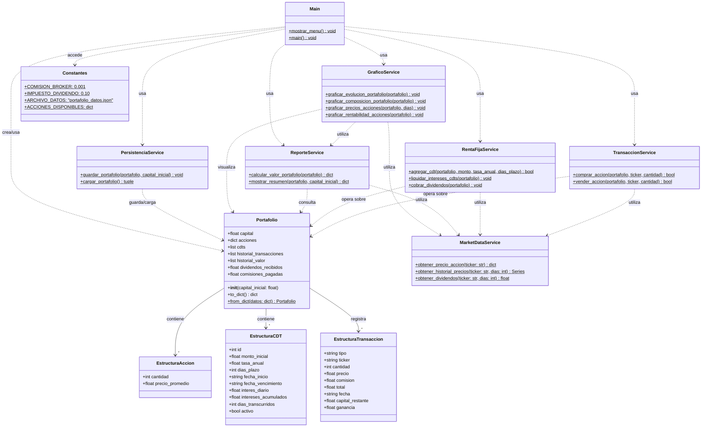
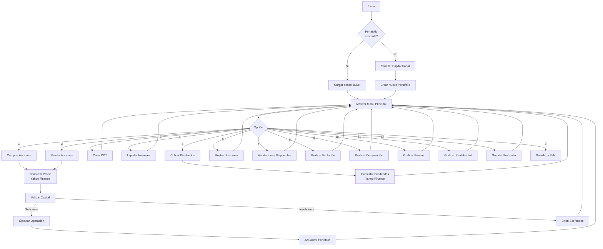
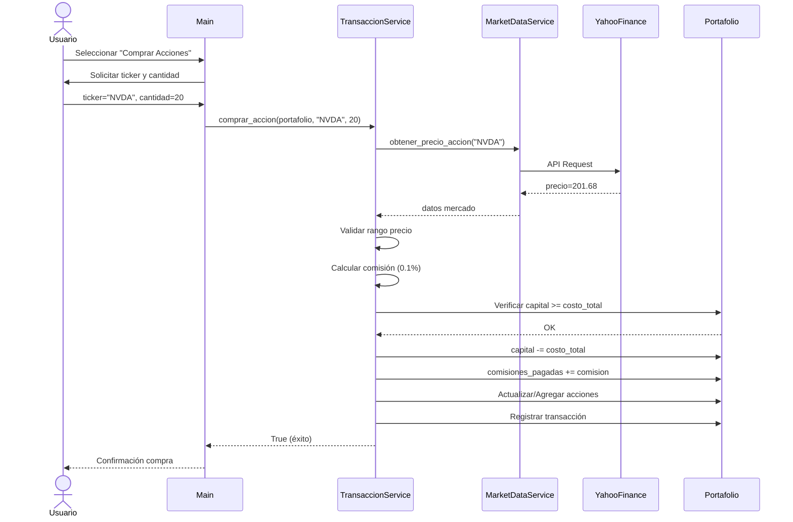
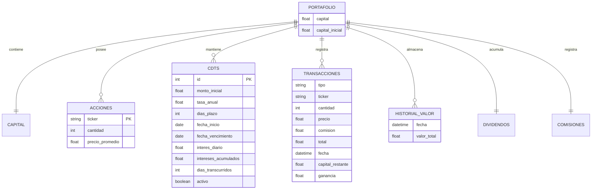

# Diagrama UML - Simulador de Portafolio de Inversión

## Diagrama de Clases (Mermaid)



---

## Diagrama de Flujo del Sistema



---

## Diagrama de Secuencia - Compra de Acción



---

## Estructura de Datos del Portafolio (JSON)



---

## Cómo Visualizar

### Opción 1: PlantUML (Recomendado)
Usar la extensión PlantUML en VS Code o el servidor online:
- Archivo: `diagrama_uml.puml`
- URL: https://www.plantuml.com/plantuml

### Opción 2: Mermaid
- Archivo: `diagrama_uml.md`
- GitHub lo renderiza automáticamente
- Extensión Mermaid Preview en VS Code

### Opción 3: Generar PNG
```bash
# Instalar PlantUML (requiere Java)
java -jar plantuml.jar diagrama_uml.puml
```
